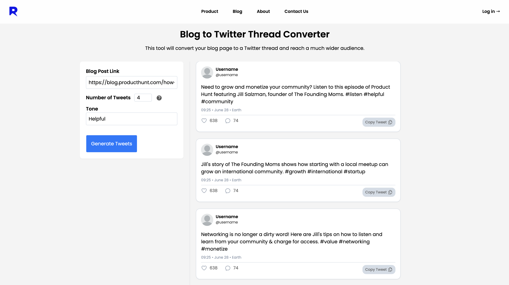

# Refrase

Refrase is a Next.js application intended to provide a set of tools for repurposing various kinds of web content.

It features a GPT-powered tool that allows you to provide a blog link and converts the content of the post to a twitter thread.



# Frontend 

```
$ cd client
$ npm install
$ npm run dev
```

# Backend

```
$ cd server
$ npm install
$ ts-node index
```

Note you will need to provide your OpenAI API keys